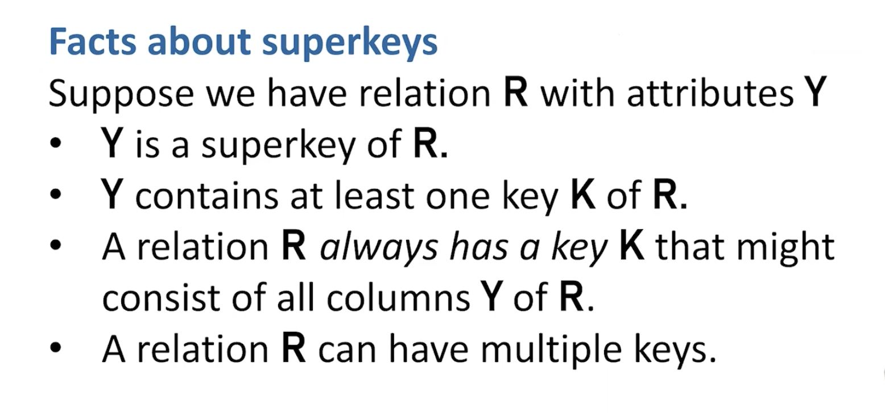
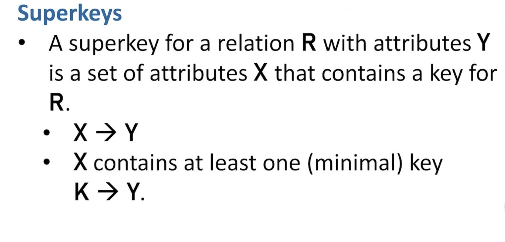

# Notes For DBMS

Relational Algebra in DBMS: Operations Symbol. **Source** (https://www.guru99.com/relational-algebra-dbms.html#15)
```
SELECT(σ)
Projection(π)
Rename (ρ)
Union operation (υ)
Set Difference (-)
Intersection (∩)
Cartesian product(X)
Inner Join:
Theta Join: ⋈θ.  r ⋈θ s = σθ (r x s) do a cross product and then select specific row within cross product
EQUI join:
NATURAL JOIN (⋈)
OUTER JOIN 
Left Outer Join(A  B)
Right Outer Join: ( A  B )
Full Outer Join: ( A  B)


```
Some equivalences for Relational Algebra


### Projection

remove column that aren't needed for further calculation.

### Sharding
```
Against large database. part of relation can split up into shard. Original = Shard1 υ Shard2 υ Shard3
```

### Theta Join: ⋈θ
```
r(name, spent) and s(name, available)
To determine people who not in debt, we might write
r ⋈θ s where θ = (r.name = s.name and r.spent < s.available)
```

### Functional Dependecies

```
Not mathematically determined. Determined by real world relationship between data elements. Thus, it's part of the requirement for solution od any database problem.
```

### Relation Key
```
K is a key for a relation R with attributes Y if:
1. K -> Y
2. No SUbset of K determines Y
Database key and relation key are different. You can make anything a key to SQL table. Relation keys must be minimal.
Key in relational algebra **IS NOT always practical** because it can overlap:
Ex.  zipcode -> city, state, country
     country, state -> city

```
### Superkey



### Boyce-Codd Norm Form


