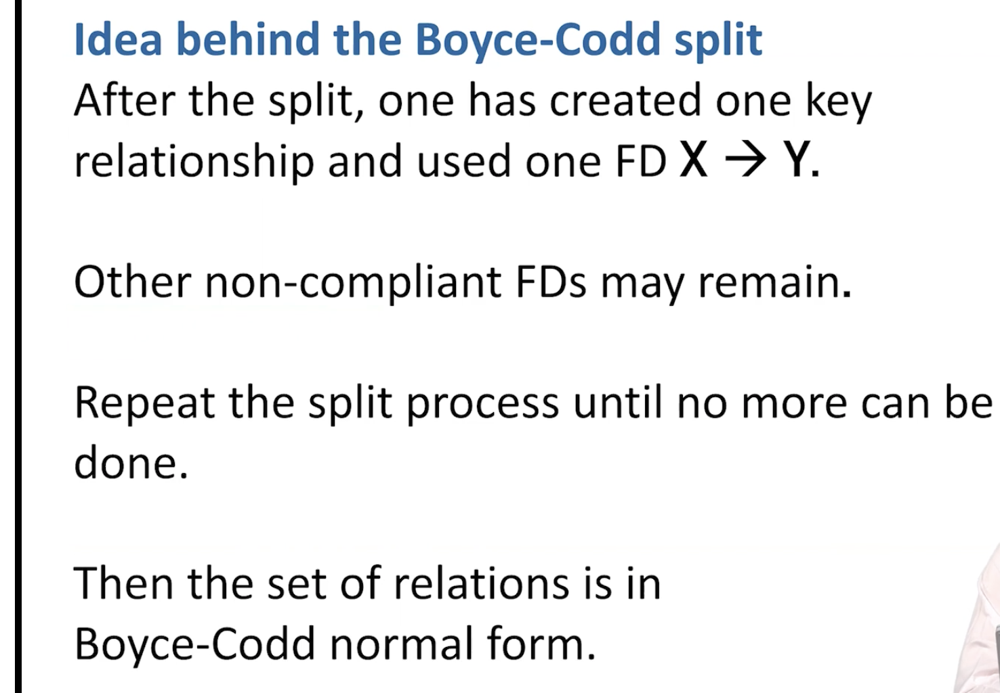

# Notes For DBMS

## Notes For Commercial DB
### AWS Redshift. Source: (https://dl.acm.org/doi/pdf/10.1145/2723372.2742795)

Targeting: 
```
1. Cost 
2. Complexity – Database provisioning, maintenance, backup, and tuning are complex tasks requiring 
   specialized skills.
3. Performance – It is difficult to grow a data warehouse without negatively impacting query
   performance. Once built, IT teams sometimes discourage augmenting data or adding queries 
   as a way of protecting current reporting SLAs.
4. Rigidity – Most databases work best on highly structured relational data. But a large and
   increasing percentage of data consists of machine-generated logs that mutate over time,
   audio and video, not readily accessible to relational analysis. 
```
Techniques:
```
columnar layout, per-column compression, co-locating compute and data, co-locating joins,
compilation to machine code and scale-out MPP processing
``` 
Design goals:
```
1. Minimize time to first report – We measure the time it takes our customers to go from
   deciding to create a cluster to seeing the results of their first query
2. Minimize administration –  automate backup, restore, provisioning, patching, failure 
   detection and repair. Advanced operations like encryption, cluster resizing and disaster
   recovery require only a few clicks to enable. 
3. Minimize scaling concerns - Many data warehousing engines provide parallelization of 
   loads and queries. We additionally try to parallelize administrative operations like cluster
   creation, patching, backup, restore and cluster resize.
``` 
System Architecture:
```
An Amazon Redshift cluster is comprised of a leader node and one or more compute nodes. We also support 
a single-node design where leader and compute work is shared on a single node.
```


```
The leader node accepts connections from client programs, parses requests, generates & compiles query plans 
for execution on the compute nodes, performs final aggregation of results when required, and coordinates 
serialization and state of transactions. The compute node(s) perform the heavy lifting inherent in both query
processing and data manipulation against local data.

Data stored within each Amazon Redshift table is automatically distributed both across compute nodes, 
to enable scale out of large data sets, and within a compute node, to reduce contention across processing 
cores. A compute node is partitioned into slices; one slice for each core of the node's multi-core processor.
Each slice is allocated a portion of the node's memory and disk space, where it processes a portion of the 
workload assigned to the node. The user can specify whether data is distributed in a round robin fashion, 
hashed according to a distribution key, or duplicated on all slices. Using distribution keys allows join 
processing on that key to be co-located on individual slices, reducing IO, CPU and network contention and
avoiding the redistribution of intermediate results during query execution. Within each slice, data storage
is columnoriented. Each column within each slice is encoded in a chain of one or more fixed size data blocks.
The linkage between the columns of an individual row is derived by calculating the logical offset within each
column chain. This linkage is stored as metadata. 

Data blocks are replicated both within the database instance and within Amazon Simple Storage Service (S3). 
Each data block is synchronously written to both its primary slice as well as to at least one secondary on 
a separate node. Cohorting is used to limit the number of slices impacted by an individual disk or node failure.

Query processing within Amazon Redshift begins with query plan generation and compilation to C++ and machine 
code at the leader node.
```


## Notes From DBMS Lecture

Relational Algebra in DBMS: Operations Symbol. **Source** (https://www.guru99.com/relational-algebra-dbms.html#15)
```
SELECT(σ)
Projection(π)
Rename (ρ)
Union operation (υ)
Set Difference (-)
Intersection (∩)
Cartesian product(X)
Inner Join:
Theta Join: ⋈θ.  r ⋈θ s = σθ (r x s) do a cross product and then select specific row within cross product
EQUI join:
NATURAL JOIN (⋈)
OUTER JOIN 
Left Outer Join(A  B)
Right Outer Join: ( A  B )
Full Outer Join: ( A  B)


```
Some equivalences for Relational Algebra


### Projection

remove column that aren't needed for further calculation.

### Sharding
```
Against large database. part of relation can split up into shard. Original = Shard1 υ Shard2 υ Shard3
```

### Theta Join: ⋈θ
```
r(name, spent) and s(name, available)
To determine people who not in debt, we might write
r ⋈θ s where θ = (r.name = s.name and r.spent < s.available)
```

### Functional Dependecies

```
Not mathematically determined. Determined by real world relationship between data elements. Thus, it's part of the requirement for solution od any database problem.
```

### Relation Key
```
K is a key for a relation R with attributes Y if:
1. K -> Y
2. No SUbset of K determines Y
Database key and relation key are different. You can make anything a key to SQL table. Relation keys must be minimal.
Key in relational algebra **IS NOT always practical** because it can overlap:
Ex.  zipcode -> city, state, country
     country, state -> city

```
### Superkey


### Boyce-Codd Norm Form


### Third Norm Form


```
We construct 3NF database byadding relations rather than splitting them.
Benefit include: lossless join, dependecy preservation.
```

### MVDs: Multi Value Dependencies

